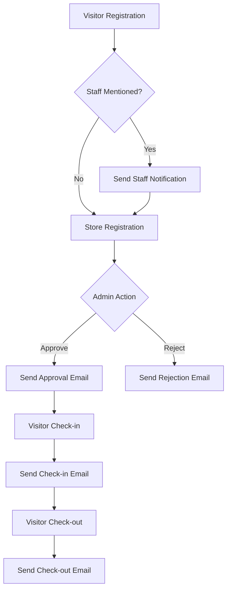

# BABAJI SHIVRAM Visitor Management System - API Documentation

## Overview

The BABAJI SHIVRAM Visitor Management System API is a comprehensive RESTful web service designed for modern organizational visitor management. Built on .NET 8 with Entity Framework Core, it provides robust visitor lifecycle management with integrated email notifications and role-based security.

## 🏗️ **System Architecture**

### Technology Stack
- **Framework**: .NET 8 Web API
- **Database**: SQL Server with Entity Framework Core
- **Authentication**: JWT (JSON Web Token)
- **Email Service**: Microsoft Office 365 Exchange Server
- **Logging**: Serilog with file and console outputs
- **Documentation**: Swagger/OpenAPI 3.0
- **Validation**: FluentValidation
- **Mapping**: AutoMapper
- **Password Hashing**: BCrypt

### Key Components
```
┌─────────────────┐    ┌─────────────────┐    ┌─────────────────┐
│   Controllers   │───▶│    Services     │───▶│   Data Layer    │
│                 │    │                 │    │                 │
│ • AuthController│    │ • AuthService   │    │ • DbContext     │
│ • EmailController│   │ • EmailService  │    │ • Repositories  │
│ • VisitorController│ │ • VisitorService│    │ • Entities      │
└─────────────────┘    └─────────────────┘    └─────────────────┘
         │                       │                       │
         ▼                       ▼                       ▼
┌─────────────────┐    ┌─────────────────┐    ┌─────────────────┐
│   Middleware    │    │  External APIs  │    │   Database      │
│                 │    │                 │    │                 │
│ • Authentication│    │ • Office 365    │    │ • SQL Server    │
│ • Authorization │    │ • SMTP Service  │    │ • Migrations    │
│ • CORS          │    │ • Email Templates│   │ • Seed Data     │
└─────────────────┘    └─────────────────┘    └─────────────────┘
```

## 🔐 **Authentication & Authorization**

### JWT Configuration
The API uses JSON Web Tokens for stateless authentication with role-based authorization.

**Token Structure:**
```json
{
  "sub": "user-id",
  "email": "user@company.com", 
  "role": "Admin",
  "exp": 1628777200,
  "iss": "VisitorManagementAPI",
  "aud": "VisitorManagementClient"
}
```

### Available Roles
- **Admin**: Full system access, user management, system configuration
- **Staff**: Staff member operations, visitor approvals
- **Reception**: Reception desk operations, visitor check-in/out

### Authentication Flow
1. **POST** `/api/auth/login` - Authenticate with email/password
2. Receive JWT token in response
3. Include token in Authorization header: `Bearer {token}`
4. Access protected endpoints based on role permissions

## 📧 **Email Notification System**

### Office 365 Integration
The system integrates with Microsoft Office 365 Exchange Server for professional email communications.

**SMTP Configuration:**
```json
{
  "EmailSettings": {
    "SmtpServer": "smtp.office365.com",
    "Port": 587,
    "Username": "gogulan.a@babajishivram.com",
    "Password": "Sri23ram",
    "EnableSsl": true,
    "FromEmail": "gogulan.a@babajishivram.com",
    "FromName": "BABAJI SHIVRAM Visitor Management System"
  }
}
```

### Email Templates
Professional HTML email templates are used for all communications:

#### 1. Staff Notification Template
Sent when visitors mention staff members during registration.
- **Subject**: `New Visitor Notification - [Visitor Name]`
- **Content**: Visitor details, purpose, expected arrival
- **Styling**: Company branding with responsive design

#### 2. Approval Confirmation Template  
Sent when visitor requests are approved.
- **Subject**: `Visit Approved - Welcome to [Company Name]`
- **Content**: Approval confirmation, visit details, instructions
- **Styling**: Green accent colors, welcoming tone

#### 3. Rejection Notification Template
Sent when visitor requests are rejected.
- **Subject**: `Visit Request Update - [Company Name]`
- **Content**: Polite rejection message, contact information
- **Styling**: Professional, respectful tone

#### 4. Check-in Confirmation Template
Sent when visitors successfully check in.
- **Subject**: `Check-in Confirmed - [Company Name]`
- **Content**: Check-in confirmation, visit duration, contact info
- **Styling**: Blue accent colors, informative

#### 5. Check-out Confirmation Template
Sent when visitors check out.
- **Subject**: `Thank you for visiting [Company Name]`
- **Content**: Thank you message, visit summary, feedback request
- **Styling**: Warm, appreciative tone

### Email Workflow


## 🛠️ **API Endpoints Documentation**

### Authentication Endpoints

#### POST /api/auth/login
Authenticate user and receive JWT token.

**Request Body:**
```json
{
  "email": "admin@company.com",
  "password": "Admin123!"
}
```

**Response (200 OK):**
```json
{
  "token": "eyJhbGciOiJIUzI1NiIsInR5cCI6IkpXVCJ9...",
  "user": {
    "id": "guid",
    "email": "admin@company.com",
    "firstName": "Admin",
    "lastName": "User",
    "role": "Admin"
  }
}
```

#### POST /api/auth/register
Register new user (Admin only).

**Headers:**
```
Authorization: Bearer {admin-jwt-token}
```

**Request Body:**
```json
{
  "email": "newuser@company.com",
  "password": "StrongPass123!",
  "firstName": "John",
  "lastName": "Doe",
  "role": "Staff"
}
```

### Email Endpoints

#### POST /api/email/test-connection
Test email server connectivity (Admin only).

**Headers:**
```
Authorization: Bearer {admin-jwt-token}
```

**Response (200 OK):**
```json
{
  "message": "Email connection test successful"
}
```

#### POST /api/email/notify-staff/{visitorId}
Send notification to staff member.

**Headers:**
```
Authorization: Bearer {jwt-token}
```

**Request Body:**
```json
{
  "staffEmail": "staff.member@company.com"
}
```

### Visitor Management Endpoints

#### GET /api/visitors
Retrieve visitor list with filtering and pagination.

**Query Parameters:**
- `page`: Page number (default: 1)
- `pageSize`: Items per page (default: 10)
- `status`: Filter by status (Pending, Approved, Rejected)
- `locationId`: Filter by location

#### POST /api/visitors
Create new visitor registration.

**Request Body:**
```json
{
  "firstName": "John",
  "lastName": "Doe",
  "email": "john.doe@email.com",
  "phone": "+1234567890",
  "company": "Visitor Company",
  "purposeOfVisit": "Business Meeting",
  "staffToMeet": "staff@company.com",
  "expectedArrival": "2025-08-05T14:30:00Z",
  "locationId": 1
}
```

#### PUT /api/visitors/{id}/approve
Approve visitor request (Staff/Admin only).

#### PUT /api/visitors/{id}/reject
Reject visitor request (Staff/Admin only).

#### POST /api/visitors/{id}/checkin
Check-in visitor (Reception/Admin only).

#### POST /api/visitors/{id}/checkout
Check-out visitor (Reception/Admin only).

## 📊 **Database Schema**

### Core Tables

#### Users
```sql
CREATE TABLE Users (
    Id NVARCHAR(450) PRIMARY KEY,
    FirstName NVARCHAR(100) NOT NULL,
    LastName NVARCHAR(100) NOT NULL,
    Email NVARCHAR(256) NOT NULL UNIQUE,
    Role INT NOT NULL,
    CreatedAt DATETIME2 DEFAULT GETUTCDATE(),
    IsActive BIT DEFAULT 1
);
```

#### Visitors
```sql
CREATE TABLE Visitors (
    Id INT IDENTITY(1,1) PRIMARY KEY,
    FirstName NVARCHAR(100) NOT NULL,
    LastName NVARCHAR(100) NOT NULL,
    Email NVARCHAR(256) NOT NULL,
    Phone NVARCHAR(20),
    Company NVARCHAR(200),
    PurposeOfVisit NVARCHAR(500),
    StaffToMeet NVARCHAR(256),
    ExpectedArrival DATETIME2,
    Status INT DEFAULT 0, -- 0=Pending, 1=Approved, 2=Rejected
    CheckInTime DATETIME2 NULL,
    CheckOutTime DATETIME2 NULL,
    LocationId INT,
    CreatedAt DATETIME2 DEFAULT GETUTCDATE()
);
```

#### EmailTemplates
```sql
CREATE TABLE EmailTemplates (
    Id INT IDENTITY(1,1) PRIMARY KEY,
    Name NVARCHAR(100) NOT NULL,
    Subject NVARCHAR(500) NOT NULL,
    HtmlBody NTEXT NOT NULL,
    PlainTextBody NTEXT,
    TemplateType INT NOT NULL,
    IsActive BIT DEFAULT 1,
    CreatedAt DATETIME2 DEFAULT GETUTCDATE(),
    UpdatedAt DATETIME2 DEFAULT GETUTCDATE()
);
```

#### Locations
```sql
CREATE TABLE Locations (
    Id INT IDENTITY(1,1) PRIMARY KEY,
    Name NVARCHAR(200) NOT NULL,
    Address NVARCHAR(500),
    ContactPhone NVARCHAR(20),
    ContactEmail NVARCHAR(256),
    IsActive BIT DEFAULT 1,
    CreatedAt DATETIME2 DEFAULT GETUTCDATE()
);
```

### Relationships
- `Visitors.LocationId` → `Locations.Id`
- `Visitors.StaffToMeet` → `Users.Email` (soft reference)

## 🔧 **Configuration**

### Application Settings

#### appsettings.json
```json
{
  "ConnectionStrings": {
    "DefaultConnection": "Server=localhost;Database=VisitorManagementDB;Integrated Security=true;TrustServerCertificate=true;MultipleActiveResultSets=true"
  },
  "Jwt": {
    "Key": "YourSuperSecretKeyThatIsAtLeast32CharactersLong!",
    "Issuer": "VisitorManagementAPI",
    "Audience": "VisitorManagementClient",
    "ExpirationMinutes": 60
  },
  "EmailSettings": {
    "SmtpServer": "smtp.office365.com",
    "Port": 587,
    "Username": "gogulan.a@babajishivram.com",
    "Password": "Sri23ram",
    "EnableSsl": true,
    "FromEmail": "gogulan.a@babajishivram.com",
    "FromName": "BABAJI SHIVRAM Visitor Management System"
  },
  "Serilog": {
    "MinimumLevel": "Information",
    "WriteTo": [
      {
        "Name": "Console"
      },
      {
        "Name": "File",
        "Args": {
          "path": "logs/app-.txt",
          "rollingInterval": "Day",
          "retainedFileCountLimit": 30
        }
      }
    ]
  }
}
```

### Environment Variables
For production deployment, sensitive settings should be stored as environment variables:

```bash
export ConnectionStrings__DefaultConnection="Server=prod-server;Database=VisitorManagementDB;..."
export EmailSettings__Password="your-secure-password"
export Jwt__Key="your-production-jwt-key"
```

## 🚀 **Deployment Guide**

### Prerequisites
- .NET 8 Runtime
- SQL Server 2019+
- Office 365 Business Account
- IIS or reverse proxy (nginx/Apache)

### Deployment Steps

1. **Build the Application**
```bash
dotnet publish -c Release -o ./publish
```

2. **Database Migration**
```bash
dotnet ef database update
```

3. **Configure IIS/Reverse Proxy**
```nginx
server {
    listen 80;
    server_name your-domain.com;
    
    location / {
        proxy_pass http://localhost:5000;
        proxy_set_header Host $host;
        proxy_set_header X-Real-IP $remote_addr;
        proxy_set_header X-Forwarded-For $proxy_add_x_forwarded_for;
        proxy_set_header X-Forwarded-Proto $scheme;
    }
}
```

4. **Configure SSL Certificate**
```bash
certbot --nginx -d your-domain.com
```

### Health Check Endpoints
- `GET /health` - Basic health check
- `GET /health/ready` - Readiness probe
- `GET /health/live` - Liveness probe

## 📈 **Performance & Monitoring**

### Logging
Structured logging with Serilog:
- **Console**: Development environment
- **File**: Production logs with daily rotation
- **Database**: Critical errors and audit trails

### Metrics
Key performance indicators:
- Response time per endpoint
- Authentication success/failure rates
- Email delivery success rates
- Database query performance
- API usage statistics

### Caching Strategy
- **Memory Cache**: Static data (locations, templates)
- **Distributed Cache**: Session data and frequently accessed data
- **HTTP Cache**: Static resources with appropriate headers

## 🛡️ **Security Considerations**

### Authentication Security
- JWT tokens with configurable expiration
- BCrypt password hashing with salt
- Role-based authorization on all sensitive endpoints
- CORS configuration for allowed origins

### Data Protection
- SQL injection prevention with parameterized queries
- XSS protection with input validation
- CSRF protection for state-changing operations
- Sensitive data encryption at rest

### Email Security
- OAuth 2.0 authentication with Office 365
- TLS encryption for SMTP connections
- Email rate limiting to prevent abuse
- Template injection prevention

## 🔄 **API Versioning**

Current version: **v1.0.0**

Versioning strategy:
- URL Path versioning: `/api/v1/endpoint`
- Header versioning: `X-API-Version: 1.0`
- Query parameter: `?version=1.0`

### Breaking Changes Policy
- Major version increment for breaking changes
- Minor version increment for new features
- Patch version increment for bug fixes
- Deprecation notices 6 months before removal

## 📚 **Development Guidelines**

### Code Standards
- Follow .NET coding conventions
- Use async/await for all I/O operations
- Implement proper error handling and logging
- Write unit tests for all business logic
- Document all public APIs with XML comments

### Testing Strategy
- **Unit Tests**: Business logic and services
- **Integration Tests**: Database operations and external APIs
- **API Tests**: End-to-end endpoint testing
- **Performance Tests**: Load testing for critical paths

### Continuous Integration
```yaml
# Azure DevOps Pipeline
trigger:
  branches:
    include:
    - main
    - develop

stages:
- stage: Build
  jobs:
  - job: BuildAndTest
    steps:
    - task: DotNetCoreCLI@2
      displayName: 'Build'
      inputs:
        command: 'build'
        projects: '**/*.csproj'
    
    - task: DotNetCoreCLI@2
      displayName: 'Test'
      inputs:
        command: 'test'
        projects: '**/*Tests.csproj'

- stage: Deploy
  condition: and(succeeded(), eq(variables['Build.SourceBranch'], 'refs/heads/main'))
  jobs:
  - job: DeployProduction
    steps:
    - task: AzureWebApp@1
      inputs:
        azureSubscription: 'Azure-Subscription'
        appName: 'visitor-management-api'
        package: '$(System.ArtifactsDirectory)/**/*.zip'
```

## 📞 **Support & Contact**

### Technical Support
- **Email**: gogulan.a@babajishivram.com
- **Phone**: [Contact Number]
- **Business Hours**: Monday - Friday, 9:00 AM - 6:00 PM IST

### Documentation
- **API Documentation**: Available at `/swagger` endpoint
- **Postman Collection**: [Link to collection]
- **GitHub Repository**: [Repository URL]

### Issue Reporting
For bug reports or feature requests:
1. Check existing issues in the repository
2. Create detailed issue with reproduction steps
3. Include API version and environment details
4. Provide relevant log snippets

---

*Last Updated: August 5, 2025*  
*Version: 1.0.0*  
*© 2025 BABAJI SHIVRAM. All rights reserved.*
