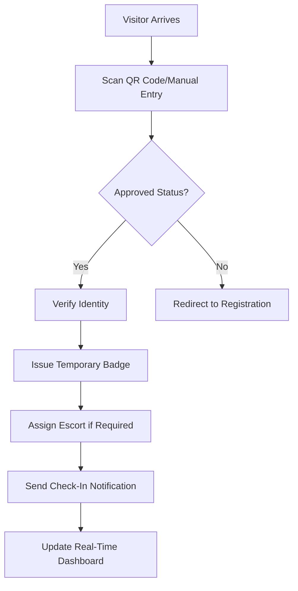

# BABAJI SHIVRAM Visitor Management System - Feature Documentation

## Document Information
- **Document Type**: Feature Specification Document
- **Version**: 1.0.0
- **Created**: August 5, 2025
- **Last Updated**: August 5, 2025
- **Author**: BABAJI SHIVRAM Development Team
- **Reviewer**: Technical Architecture Team
- **Status**: Active Development

---

## Table of Contents
1. [System Overview](#system-overview)
2. [Core Features](#core-features)
3. [Authentication & Authorization](#authentication--authorization)
4. [Email Notification System](#email-notification-system)
5. [Visitor Management Lifecycle](#visitor-management-lifecycle)
6. [Location & Staff Management](#location--staff-management)
7. [System Configuration](#system-configuration)
8. [Reporting & Analytics](#reporting--analytics)
9. [Security Features](#security-features)
10. [Integration Capabilities](#integration-capabilities)
11. [User Interface Features](#user-interface-features)
12. [Performance Features](#performance-features)
13. [Future Enhancements](#future-enhancements)

---

## System Overview

### Purpose
The BABAJI SHIVRAM Visitor Management System is an enterprise-grade solution designed to streamline visitor registration, approval workflows, and on-site management across multiple organizational locations.

### Target Users
- **Reception Staff**: Front desk personnel managing visitor check-in/check-out
- **Office Staff**: Employees receiving visitor notifications and approvals
- **Administrators**: System administrators managing users, locations, and configurations
- **Visitors**: External individuals requesting access to organizational facilities

### Key Benefits
- **Automated Workflows**: Streamlined visitor approval and notification processes
- **Enhanced Security**: Role-based access control and visitor tracking
- **Professional Communication**: Branded email templates with Office 365 integration
- **Multi-Location Support**: Centralized management across multiple office locations
- **Real-Time Tracking**: Live visitor status monitoring and reporting

---

## Core Features

### F001: Visitor Registration System

#### Feature Description
Comprehensive visitor registration system allowing external visitors to request access to organizational facilities through a user-friendly interface.

#### Functional Requirements
- **F001.1**: Online visitor registration form with required and optional fields
- **F001.2**: Custom field support for organization-specific requirements
- **F001.3**: Staff member selection for visit coordination
- **F001.4**: Expected arrival time scheduling with timezone support
- **F001.5**: Purpose of visit categorization and description
- **F001.6**: Company and contact information capture
- **F001.7**: Location-specific registration with capacity management

#### Technical Specifications
```csharp
public class VisitorRegistrationRequest
{
    public string FirstName { get; set; }           // Required
    public string LastName { get; set; }            // Required  
    public string Email { get; set; }               // Required, Validated
    public string Phone { get; set; }               // Optional
    public string Company { get; set; }             // Optional
    public string PurposeOfVisit { get; set; }      // Required
    public string StaffToMeet { get; set; }         // Optional, Triggers notification
    public DateTime ExpectedArrival { get; set; }   // Required
    public int LocationId { get; set; }             // Required
    public Dictionary<string, string> CustomFields { get; set; } // Optional
}
```

#### Business Rules
- Email addresses must be unique per visit session
- Expected arrival time cannot be in the past
- Staff member must be active and assigned to the selected location
- Custom fields are validated based on location-specific configurations
- Maximum 5 visitors can be registered simultaneously by the same person

#### User Stories
- **US001**: As a visitor, I want to register for a visit online so that I can provide my information in advance
- **US002**: As a visitor, I want to specify whom I'm visiting so that the appropriate staff member is notified
- **US003**: As a visitor, I want to select my visit purpose so that the organization can prepare appropriately

### F002: Approval Workflow System

#### Feature Description
Multi-stage approval workflow allowing designated staff members to review and approve/reject visitor requests based on organizational policies.

#### Functional Requirements
- **F002.1**: Automated routing of visitor requests to appropriate approvers
- **F002.2**: Role-based approval permissions (Staff, Manager, Admin levels)
- **F002.3**: Bulk approval capabilities for multiple visitor requests
- **F002.4**: Approval notes and comments system
- **F002.5**: Escalation workflow for delayed approvals
- **F002.6**: Override capabilities for emergency approvals
- **F002.7**: Automated rejection with customizable reason templates

#### Workflow States
```csharp
public enum VisitorStatus
{
    Pending = 0,        // Initial registration state
    UnderReview = 1,    // Assigned to approver
    Approved = 2,       // Approved for visit
    Rejected = 3,       // Rejected with reason
    CheckedIn = 4,      // Currently on premises
    CheckedOut = 5,     // Visit completed
    Expired = 6,        // Approval expired without check-in
    Cancelled = 7       // Cancelled by visitor or staff
}
```

#### Business Rules
- Approval required within 24 hours of expected arrival
- Staff members can only approve visitors assigned to their department
- Managers can approve any visitor for their location
- Admins have override approval capabilities across all locations
- Rejected visitors cannot reapply for 24 hours unless manually overridden

### F003: Real-Time Check-In/Check-Out System

#### Feature Description
Streamlined check-in and check-out process for approved visitors with real-time status tracking and security badge management.

#### Functional Requirements
- **F003.1**: QR code-based check-in for approved visitors
- **F003.2**: Manual check-in by reception staff with visitor verification
- **F003.3**: Temporary badge assignment and tracking
- **F003.4**: Escort assignment for restricted areas
- **F003.5**: Real-time visitor location tracking within facilities
- **F003.6**: Automated check-out reminders and notifications
- **F003.7**: Emergency evacuation visitor tracking

#### Check-In Process Flow


#### Security Features
- Photo verification during check-in process
- Government ID validation for high-security locations
- Biometric check-in options (fingerprint/facial recognition)
- Background check integration for extended visits
- Real-time security alert system for unauthorized access attempts

---

## Authentication & Authorization

### F004: Role-Based Access Control (RBAC)

#### Feature Description
Comprehensive role-based security system ensuring appropriate access levels for different user types across the organization.

#### Role Definitions

##### R001: System Administrator
**Permissions:**
- Full system configuration access
- User management across all locations
- Email template customization
- System monitoring and maintenance
- Database backup and restore operations
- Security audit log access

**Capabilities:**
```csharp
[Authorize(Roles = "Admin")]
public class AdminCapabilities
{
    public bool CanManageUsers => true;
    public bool CanConfigureSystem => true;
    public bool CanAccessAllLocations => true;
    public bool CanModifyEmailTemplates => true;
    public bool CanViewAuditLogs => true;
    public bool CanOverrideApprovals => true;
}
```

##### R002: Location Manager
**Permissions:**
- Location-specific user management
- Visitor approval for assigned location
- Staff schedule management
- Location-specific reporting
- Visitor capacity management

##### R003: Staff Member
**Permissions:**
- Visitor approval for own department
- Personal visitor history access
- Notification preferences management
- Basic reporting for assigned visitors

##### R004: Reception Staff
**Permissions:**
- Visitor check-in/check-out operations
- Visitor search and status updates
- Badge management and assignment
- Real-time visitor dashboard access
- Emergency evacuation procedures

### F005: JWT Token Authentication

#### Feature Description
Secure JSON Web Token-based authentication system providing stateless authentication with configurable expiration and refresh capabilities.

#### Token Structure
```json
{
  "sub": "user-id",
  "email": "user@company.com",
  "role": "Staff",
  "locationId": "loc-001",
  "permissions": ["visitor.approve", "visitor.view"],
  "exp": 1628777200,
  "iss": "VisitorManagementAPI",
  "aud": "VisitorManagementClient"
}
```

#### Security Specifications
- **Algorithm**: HMAC SHA-256
- **Token Expiration**: 8 hours (configurable)
- **Refresh Token**: 30 days (configurable)
- **Key Rotation**: Monthly automatic rotation
- **Blacklist Support**: Immediate token revocation capability

---

## Email Notification System

### F006: Office 365 Integration

#### Feature Description
Seamless integration with Microsoft Office 365 Exchange Server for professional email communications throughout the visitor management lifecycle.

#### Integration Specifications
```json
{
  "SmtpConfiguration": {
    "Server": "smtp.office365.com",
    "Port": 587,
    "Security": "STARTTLS",
    "Authentication": "OAuth2.0",
    "SenderAddress": "gogulan.a@babajishivram.com",
    "SenderName": "BABAJI SHIVRAM Visitor Management"
  }
}
```

#### Supported Email Types

##### E001: Staff Notification Emails
**Trigger**: Visitor mentions staff member during registration
**Template**: Professional HTML with company branding
**Content Includes**:
- Visitor personal information and contact details
- Purpose of visit and expected duration
- Meeting location and special requirements
- Approval/rejection action buttons
- Calendar integration for meeting scheduling

##### E002: Visitor Approval Confirmations
**Trigger**: Staff member approves visitor request
**Template**: Welcome-themed with green accent colors
**Content Includes**:
- Approval confirmation with reference number
- Visit details and location information
- Check-in instructions and QR code
- Contact information for assistance
- Parking and facility access information

##### E003: Visitor Rejection Notifications
**Trigger**: Staff member rejects visitor request
**Template**: Professional, respectful tone
**Content Includes**:
- Polite rejection message
- Reason for rejection (if provided)
- Alternative contact methods
- Instructions for future visit requests
- Company contact information

##### E004: Check-In/Check-Out Confirmations
**Trigger**: Visitor check-in or check-out action
**Template**: Informational with blue accent colors
**Content Includes**:
- Timestamp confirmation
- Visit duration information
- Emergency contact details
- Facility guidelines and restrictions
- Thank you message and feedback request

### F007: Email Template Management

#### Feature Description
Dynamic email template system allowing administrators to customize email content, styling, and branding while maintaining professional standards.

#### Template Features
- **HTML/CSS Customization**: Full control over email appearance
- **Placeholder System**: Dynamic content insertion using {{placeholders}}
- **Multi-Language Support**: Templates in multiple languages
- **Brand Compliance**: Automatic company logo and color scheme application
- **Mobile Responsive**: Optimized display across all devices
- **A/B Testing**: Template performance comparison capabilities

#### Placeholder Variables
```csharp
public class EmailPlaceholders
{
    public string VisitorName { get; set; }         // {{VisitorName}}
    public string StaffName { get; set; }           // {{StaffName}}
    public string CompanyName { get; set; }         // {{CompanyName}}
    public string VisitPurpose { get; set; }        // {{VisitPurpose}}
    public string ExpectedArrival { get; set; }     // {{ExpectedArrival}}
    public string LocationName { get; set; }        // {{LocationName}}
    public string ApprovalCode { get; set; }        // {{ApprovalCode}}
    public string QrCodeUrl { get; set; }           // {{QrCodeUrl}}
    public string ContactPhone { get; set; }        // {{ContactPhone}}
    public string VisitDuration { get; set; }       // {{VisitDuration}}
}
```

---

## Visitor Management Lifecycle

### F008: Complete Visitor Journey

#### Feature Description
End-to-end visitor experience management from initial registration through post-visit follow-up, ensuring smooth and professional interactions.

#### Journey Stages

##### Stage 1: Pre-Visit Registration
**Duration**: 24-48 hours before visit
**Activities**:
- Online registration form completion
- Staff notification and approval workflow
- Confirmation email with visit details
- Calendar integration and meeting scheduling
- Parking reservation (if applicable)

##### Stage 2: Arrival and Check-In
**Duration**: 5-10 minutes
**Activities**:
- QR code scanning or manual check-in
- Identity verification and photo capture
- Temporary badge issuance
- Escort assignment for restricted areas
- Orientation briefing and safety instructions

##### Stage 3: On-Site Visit
**Duration**: Variable based on purpose
**Activities**:
- Real-time location tracking
- Access control to authorized areas
- Meeting room booking and management
- Emergency evacuation procedures
- Visitor assistance and support

##### Stage 4: Departure and Check-Out
**Duration**: 2-3 minutes
**Activities**:
- Badge return and deactivation
- Exit time recording
- Visit feedback collection
- Thank you email with visit summary
- Follow-up meeting scheduling (if applicable)

##### Stage 5: Post-Visit Follow-Up
**Duration**: 24-48 hours after visit
**Activities**:
- Automated feedback survey
- Visit report generation
- Future visit recommendations
- Relationship management updates
- Security clearance archival

### F009: Visitor History and Analytics

#### Feature Description
Comprehensive visitor tracking and analytics system providing insights into visitor patterns, staff productivity, and organizational security metrics.

#### Analytics Capabilities
- **Visitor Frequency Analysis**: Repeat visitor identification and VIP recognition
- **Peak Time Analysis**: Optimal staffing and resource allocation insights
- **Approval Rate Metrics**: Staff performance and policy effectiveness analysis
- **Location Utilization**: Space planning and capacity optimization data
- **Security Incident Tracking**: Unauthorized access attempts and security breaches
- **Visitor Satisfaction Scores**: Service quality measurement and improvement

#### Reporting Features
```csharp
public class VisitorAnalytics
{
    public int TotalVisitors { get; set; }
    public decimal ApprovalRate { get; set; }
    public TimeSpan AverageVisitDuration { get; set; }
    public Dictionary<string, int> VisitorsByDepartment { get; set; }
    public List<PeakHour> BusiestTimes { get; set; }
    public decimal RepeatVisitorPercentage { get; set; }
    public List<SecurityIncident> SecurityEvents { get; set; }
}
```

---

## Location & Staff Management

### F010: Multi-Location Support

#### Feature Description
Centralized management system supporting multiple office locations with location-specific configurations, staff assignments, and visitor policies.

#### Location Features
- **Location Profiles**: Detailed facility information and capabilities
- **Capacity Management**: Maximum visitor limits and real-time occupancy
- **Security Levels**: Varying access controls based on facility classification
- **Operating Hours**: Location-specific business hours and holiday schedules
- **Facility Amenities**: Available services and visitor accommodations
- **Emergency Procedures**: Location-specific safety and evacuation protocols

#### Location Configuration
```csharp
public class LocationProfile
{
    public int LocationId { get; set; }
    public string Name { get; set; }
    public Address PhysicalAddress { get; set; }
    public ContactInformation ContactInfo { get; set; }
    public int MaximumVisitorCapacity { get; set; }
    public SecurityLevel SecurityClassification { get; set; }
    public OperatingHours BusinessHours { get; set; }
    public List<Amenity> AvailableAmenities { get; set; }
    public EmergencyProcedures SafetyProtocols { get; set; }
}
```

### F011: Staff Directory and Management

#### Feature Description
Comprehensive staff management system with department organization, role assignments, and visitor approval capabilities.

#### Staff Features
- **Department Organization**: Hierarchical staff structure with reporting relationships
- **Role-Based Permissions**: Granular access control based on job responsibilities
- **Visitor Approval Limits**: Daily and concurrent visitor limitations per staff member
- **Notification Preferences**: Customizable communication settings and schedules
- **Availability Calendar**: Staff schedule integration for visitor coordination
- **Performance Metrics**: Visitor approval and response time analytics

---

## System Configuration

### F012: Dynamic Role Configuration

#### Feature Description
Flexible role management system allowing administrators to create custom roles with specific permissions and capabilities.

#### Configuration Features
- **Custom Role Creation**: Define new roles with specific permission sets
- **Permission Granularity**: Fine-grained control over system capabilities
- **Role Hierarchy**: Parent-child role relationships with permission inheritance
- **Temporary Role Assignment**: Time-limited role elevation for special projects
- **Role Audit Trail**: Complete history of role changes and assignments

### F013: Business Rules Engine

#### Feature Description
Configurable business rules system allowing organizations to customize visitor management workflows according to their specific requirements.

#### Configurable Rules
- **Approval Workflows**: Multi-stage approval processes with escalation
- **Visit Duration Limits**: Maximum visit times based on visitor type and location
- **Capacity Management**: Dynamic visitor limits based on facility occupancy
- **Security Restrictions**: Access limitations based on visitor background checks
- **Notification Timing**: Automated reminder and follow-up schedules

---

## Security Features

### F014: Comprehensive Audit Logging

#### Feature Description
Complete audit trail system recording all user actions, system events, and security-related activities for compliance and investigation purposes.

#### Logged Events
- User authentication and authorization attempts
- Visitor registration and approval actions
- Check-in/check-out activities with timestamps
- System configuration changes
- Email notification deliveries
- Security incidents and access violations
- Data export and report generation activities

#### Audit Log Structure
```csharp
public class AuditLogEntry
{
    public DateTime Timestamp { get; set; }
    public string UserId { get; set; }
    public string Action { get; set; }
    public string ResourceType { get; set; }
    public string ResourceId { get; set; }
    public string IpAddress { get; set; }
    public string UserAgent { get; set; }
    public string Details { get; set; }
    public SecurityLevel RiskLevel { get; set; }
}
```

### F015: Data Protection and Privacy

#### Feature Description
Comprehensive data protection system ensuring compliance with privacy regulations and organizational security policies.

#### Privacy Features
- **Data Encryption**: AES-256 encryption for sensitive visitor information
- **Data Retention**: Configurable data retention policies with automatic purging
- **Consent Management**: Visitor consent tracking for data processing
- **Right to Deletion**: Visitor data removal capabilities upon request
- **Data Export**: Visitor data export in standardized formats
- **Anonymization**: Personal data anonymization for analytics and reporting

---

## Integration Capabilities

### F016: API Integration Framework

#### Feature Description
RESTful API framework enabling integration with third-party systems and custom applications.

#### Integration Points
- **HR Systems**: Employee directory synchronization
- **Access Control**: Physical security system integration
- **Calendar Systems**: Meeting scheduling and room booking
- **CRM Platforms**: Customer relationship management integration
- **Reporting Tools**: Business intelligence and analytics platforms

### F017: Webhook System

#### Feature Description
Real-time event notification system allowing external systems to receive immediate updates about visitor activities.

#### Available Webhooks
- Visitor registration events
- Approval/rejection notifications
- Check-in/check-out activities
- Security incidents and alerts
- System configuration changes

---

## Performance Features

### F018: Scalability and Performance

#### Feature Description
High-performance architecture designed to handle large volumes of visitors and concurrent users across multiple locations.

#### Performance Specifications
- **Concurrent Users**: Support for 1,000+ simultaneous users
- **Visitor Capacity**: Handle 10,000+ daily visitor registrations
- **Response Time**: Sub-second API response times
- **Uptime**: 99.9% system availability guarantee
- **Data Storage**: Scalable database architecture with automatic sharding

### F019: Caching and Optimization

#### Feature Description
Multi-layer caching system optimizing performance and reducing server load.

#### Caching Strategies
- **Memory Caching**: Frequently accessed data in server memory
- **Redis Caching**: Distributed caching for multi-server deployments
- **CDN Integration**: Static asset delivery optimization
- **Database Query Optimization**: Intelligent query caching and indexing

---

## Future Enhancements

### F020: Planned Features (Phase 2)

#### Integration Expansions
- Microsoft Teams integration for visitor notifications
- Active Directory synchronization for staff management


## Conclusion

The BABAJI SHIVRAM Visitor Management System represents a comprehensive solution for modern organizational visitor management needs. With its robust feature set, scalable architecture, and integration capabilities, the system provides a professional and secure visitor experience while streamlining administrative processes.

### Key Success Metrics
- **User Adoption**: 95% staff adoption rate within 30 days
- **Visitor Satisfaction**: 4.5/5 average visitor experience rating
- **Process Efficiency**: 60% reduction in visitor processing time
- **Security Compliance**: 100% audit trail coverage for all visitor activities
- **System Reliability**: 99.9% uptime with sub-second response times

### Support and Maintenance
- 24/7 technical support during business hours
- Regular feature updates and security patches
- Comprehensive user training and documentation
- Ongoing performance monitoring and optimization

---

**Document Control**
- **Classification**: Internal Use
- **Distribution**: Development Team, Product Management, Quality Assurance
- **Review Cycle**: Quarterly updates with major releases
- **Approval**: Technical Architecture Board

*© 2025 BABAJI SHIVRAM. All rights reserved.*
